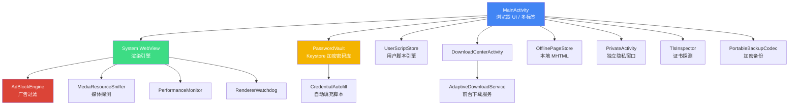
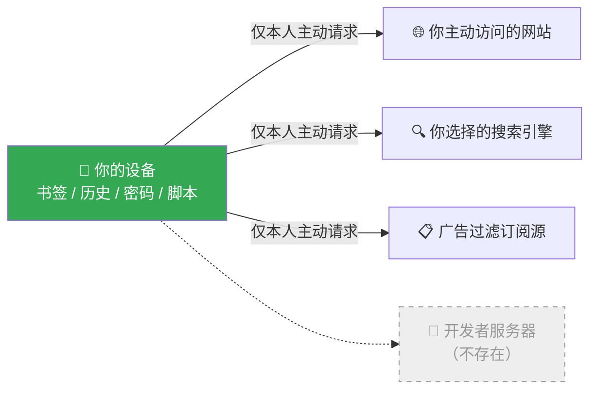

<div align="center">


**无限进步，无限优化，无限极速**
**基于 Android System WebView，原生 Java 实现，广告拦截 + 密码库 + 用户脚本 + 离线阅读+ 高自由自定义主页等功能。**

<br/>


<br/>

[💬 加入 Telegram 社区](https://t.me/MedianBeta) ·
[🐞 反馈问题](#-问题反馈) ·
[🏗 编译指南](#-编译项目) ·
[❓ 常见问题](#-常见问题-faq)

**如果这个项目对你有帮助，请点一个 ⭐️ Star，这是对独立开发者最好的支持。**

|:---:|:---:|:---:|:---:|:---:|


</div>

---

## 📖 目录

- [Median Browser 是什么](#-median-browser-是什么)
- [核心特性](#-核心特性)
- [Median 与普通浏览器的区别](#-median-与普通浏览器的区别)
- [隐私与数据边界](#-隐私与数据边界)
- [技术架构](#-技术架构)
- [编译项目](#-编译项目)
- [项目结构](#-项目结构)
- [权限说明](#-权限说明)
- [Roadmap](#-roadmap)
- [常见问题 FAQ](#-常见问题-faq)
- [安全策略](#-安全策略)
- [贡献指南](#-贡献指南)
- [问题反馈](#-问题反馈)
- [License](#-license)

---

## 🔍 Median Browser 是什么

> **Median Browser 是一款运行在 Android 系统 WebView 之上的本地优先浏览器**，用原生 Java 编写，不依赖 Chromium 私有内核、不集成广告 / 分析 / 崩溃上报 SDK，也没有开发者运营的账号或同步服务器。书签、历史、密码、用户脚本、下载记录等数据默认只保存在设备本地。

一句话回答（适合快速引用）：

- **Median 是什么** → 一个基于 WebView 的原生 Android 浏览器，主打广告拦截、本地密码库、用户脚本和离线阅读。
- **Median 是不是开源** → 源码公开可读，但采用「保留所有权利」的源码可见许可，**并非 MIT / GPL 意义上的开源协议**，转发 / 二次分发前请先阅读 [License](#-license)。
- **Median 会不会收集用户数据** → 不会。应用内没有分析、广告或遥测后台，网络请求只发生在用户主动访问的网站与服务之间。

---

## 🚀 核心特性

<table>
<tr>
<td width="50%" valign="top">

### 🛡️ 广告拦截 · AdBlockEngine

- 基于 ABP / hosts 规则的过滤引擎，专为 WebView 请求回调优化
- 支持在线过滤订阅源，可自定义添加与更新（`FilterSubscriptionStore`）
- 元素隐藏、跟踪参数清理、逐站点开关

</td>
<td width="50%" valign="top">

### 🔐 密码库 · PasswordVault

- 基于 **Android Keystore + AES-GCM** 的本地加密密码库
- HTTPS 自动填充默认开启，登录后自动提示保存
- 支持多账号、多步登录、Shadow DOM 与同源 iframe

</td>
</tr>

<tr>
<td width="50%" valign="top">

### 📥 下载中心 · Download Center

- 分段下载、暂停 / 恢复、断点续传、自适应重试策略
- 前台服务保活（`AdaptiveDownloadService`），大文件不中断
- 独立下载内容提供者，安装包 / 文件均可直接管理

</td>
<td width="50%" valign="top">

### 📴 离线与阅读

- 本地 MHTML 离线网页归档，**页面字节不出设备**
- 阅读模式、系统朗读（TTS）、网页翻译、页内查找
- 首页收藏、收藏夹、Favicon 本地缓存

</td>
</tr>

<tr>
<td width="50%" valign="top">

### 🧩 用户脚本 · UserScript

- 类 Tampermonkey 的用户脚本引擎，`document-start` 原生桥接注入
- 显式权限声明与 `@connect` 目标校验，最小权限执行
- GM 兼容层：正则匹配、相对 URL 解析、UTF-8 资源回退

</td>
<td width="50%" valign="top">

### 🕵️ 独立隐私窗口

- 与普通标签完全隔离的私密浏览会话
- **无法可靠隔离时不会伪装成"无痕模式"欺骗用户**
- 独立 Activity 进程边界，退出即清除

</td>
</tr>

<tr>
<td width="50%" valign="top">

### 🎬 媒体探测 · MediaResourceSniffer

- 有界、只读元数据的媒体资源索引
- 覆盖 HLS / DASH / Smooth Streaming 清单解析
- 显示轨道、分辨率、码率、加密与直播 / 点播标记

</td>
<td width="50%" valign="top">

### ⚡ 三档性能模式

- `PerformanceMonitor` 实时帧耗时与掉帧监控
- 性能 / 标准 / 低功耗三档渲染策略可切换
- `RendererWatchdog` 自动检测并恢复无响应渲染进程

</td>
</tr>

<tr>
<td width="50%" valign="top">

### 🔒 TLS 证书检查

- `TlsInspector` 按需发起独立证书探测
- 展示证书链、加密套件、颁发者与有效期
- 仅在用户主动触发时执行，不做后台监听

</td>
<td width="50%" valign="top">

### 💾 加密备份与手势导航

- `PortableBackupCodec`：密码加密的便携式备份，无需服务器
- 边缘滑动手势前进 / 后退（`EdgeNavigationController`）
- 逐站点权限（JS / 图片 / 定位等）精细控制

</td>
</tr>
</table>

---

## ⚔️ Median 与普通浏览器的区别

| 维度 | Median Browser | 常见商业浏览器 |
|---|:---:|:---:|
| 渲染内核 | 系统 WebView（跟随系统更新） | 自带 Chromium 分支，体积大 |
| 广告 / 分析 SDK | ❌ 无 | 通常内置多个 |
| 遥测 / 崩溃上报 | ❌ 无 | 默认开启 |
| 账号与云同步 | ❌ 无开发者服务器 | 强制或默认绑定账号 |
| 密码存储方式 | Android Keystore + AES-GCM，本地 | 部分依赖云端同步 |
| 用户脚本支持 | ✅ 原生桥接注入 | 需第三方插件商店 |
| 安装包体积 | 约 **215 KB** 级别 | 普遍数十至上百 MB |
| 隐私窗口真实性 | 隔离失败会明确提示 | 部分产品仍标注"无痕" |

**功能模块一览**（源码中实际存在的独立模块，无一依赖云端）：

| 模块 | 是否本地运行 | 是否需要网络权限外的额外权限 |
|---|:---:|:---:|
| 广告拦截引擎 | ✅ 完全本地 | ❌ |
| 密码库 + 自动填充 | ✅ Keystore 加密本地 | ❌ |
| 下载中心 | ✅ 本地 | 前台服务通知权限 |
| 用户脚本引擎 | ✅ 本地注入 | ❌ |
| 离线归档 + 阅读 | ✅ 纯本地 MHTML | ❌ |
| 遥测 / 分析 SDK | 🚫 不存在 | — |

---

## 🧭 隐私与数据边界

Median 遵循**本地优先（local-first）**原则，这是代码和隐私政策中明确的边界，而不是营销口号：

- ✅ 应用**不**运行开发者账号、同步服务器、广告网络、分析或遥测后台
- ✅ 书签、历史、标签会话、Cookie、下载记录、离线页面、过滤规则、用户脚本、密码与设置**默认只存于本机**
- ✅ 密码库使用 Android Keystore 生成的密钥 + AES-GCM 加密；导出备份需用户自定义密码二次加密
- ⚠️ 浏览、搜索、翻译、更新过滤订阅、安装用户脚本、下载文件时，**目标网站 / 服务**会按其自身隐私政策收到正常网络请求 —— 这是浏览器的基本工作方式，Median 不会中转或截留这些流量
- ⚠️ 用户脚本是用户主动安装的第三方代码，权限高于普通网页，请只从可信来源安装

更多细节见仓库中的 [`PRIVACY_POLICY.md`](PRIVACY_POLICY.md) 与 [`PLAY_DATA_SAFETY.md`](PLAY_DATA_SAFETY.md)。

---

## 🏗 技术架构

| 类别 | 选型 |
|---|---|
| 目标平台 | Android 8.0 (API 26) 及以上，`compileSdk` / `targetSdk` 36 |
| 渲染引擎 | Android System WebView（含 AndroidX WebKit 兼容层） |
| 开发语言 | Java 17 |
| 构建系统 | Gradle（AGP 8.13.2） |
| 包名 / 命名空间 | `com.xinyv.median`，`applicationId com.xinyv.median.compat` |
| 加密方案 | Android Keystore、AES-GCM、PBKDF2 便携备份 |
| 压缩与混淆 | R8 `minifyEnabled` + `shrinkResources` |

**模块关系图**（GitHub 原生渲染 Mermaid）：



**隐私数据流向图** —— 注意图中不存在任何"开发者服务器"节点：



**核心模块一览（节选自源码）：**

```
AdBlockEngine          广告与规则过滤引擎
PasswordVault          Keystore 加密密码库
CredentialAutofill     跨 Shadow DOM / iframe 的自动填充脚本生成器
FilterSubscriptionStore 广告过滤订阅源管理
UserScriptStore         用户脚本存储与匹配
MediaResourceSniffer    媒体资源探测（HLS/DASH/Smooth Streaming）
OfflinePageStore        本地 MHTML 离线归档
DownloadCenterActivity  下载中心 UI 与管理
AdaptiveDownloadService 前台下载服务
TlsInspector            按需 TLS/证书探测
PortableBackupCodec     密码加密便携备份
PerformanceMonitor      帧耗时 / 卡顿监控
RendererWatchdog        WebView 渲染进程看门狗
EdgeNavigationController 边缘手势导航
SiteSettingsStore        逐站点权限设置
```

---

## 📦 编译项目

### 环境要求

- Android Studio（最新稳定版）
- JDK 17+
- Android SDK（`compileSdk` 36）

### 克隆项目

```bash
git clone https://github.com/bi-box/Median.git
cd Median
```

### 编译 Debug / Release

```bash
# Debug 包
./gradlew assembleDebug

# Release 包（如需签名，先配置以下环境变量）
# MEDIAN_KEYSTORE / MEDIAN_STOREPASS / MEDIAN_KEY_ALIAS / MEDIAN_KEYPASS
./gradlew assembleRelease
```

产物路径：

```
app/build/outputs/apk/
```

---

## 📂 项目结构

```
Median
├── app
│   ├── src/main/java/com/xinyv/median   # 浏览器核心源码（广告拦截、密码库、下载、脚本…）
│   ├── src/main/java/androidx/webkit    # WebView 兼容层
│   └── src/main/res                     # 界面资源
├── gradle                               # Gradle Wrapper 配置
├── tools                                # 开发辅助脚本
├── build.gradle / settings.gradle       # 构建配置
├── SECURITY.md                          # 安全策略与威胁模型
├── PRIVACY_POLICY.md                    # 隐私政策
├── PLAY_DATA_SAFETY.md                  # Google Play 数据安全申报草稿
├── CHANGELOG.md                         # 版本变更记录
└── THIRD_PARTY_NOTICES.md               # 第三方组件与许可证
```

---

## 🔑 权限说明

| 权限 | 用途 | 触发条件 |
|---|---|---|
| Camera / Microphone | 网页调用摄像头 / 麦克风 | 仅 HTTPS 页面主动请求且用户授权后生效 |
| Location | 网页定位 | 仅 HTTPS 页面主动请求且用户授权后生效 |
| Notifications / Foreground Service | 展示与控制下载进度 | 下载进行中 |
| Network State / Wake Lock | 保证下载约束与传输完整 | 仅下载期间，普通浏览不持有唤醒锁 |
| Install Packages | 安装下载到本地的 APK | 用户主动点击安装 |

---

## 🛣 Roadmap

**✅ 已实现（源码可见）**

- 广告过滤订阅 + 元素隐藏
- Keystore 加密密码库与自动填充
- 分段下载 / 断点续传 / 下载中心
- 用户脚本引擎（document-start 注入）
- 离线网页归档 + 阅读模式 + 翻译 + 朗读
- 独立隐私窗口、逐站点权限、边缘手势导航
- TLS 证书探测、加密便携备份、性能与渲染看门狗

**🔄 计划中**

- 更多浏览器自定义选项
- 更完善的隐私控制面板
- 更丰富的辅助功能支持

---

## ❓ 常见问题 FAQ

<details>
<summary><b>Median Browser 是原生浏览器还是套壳浏览器？</b></summary><br/>

Median 使用 Android **System WebView** 渲染网页，不打包私有 Chromium 内核，因此安装包体积极小（约 215 KB 级别），网页兼容性和渲染性能跟随系统 WebView 版本更新。
</details>

<details>
<summary><b>Median 支持广告拦截吗？</b></summary><br/>

支持。内置 <code>AdBlockEngine</code> 过滤引擎，兼容 ABP / hosts 规则，可订阅在线过滤列表，并支持元素隐藏与跟踪参数清理。
</details>

<details>
<summary><b>密码保存在哪里，安全吗？</b></summary><br/>

密码保存在设备本地的 <code>PasswordVault</code> 中，密钥由 Android Keystore 生成并使用 AES-GCM 加密，不会上传到任何服务器。导出的便携备份需用户自定义密码二次加密。
</details>

<details>
<summary><b>Median 支持用户脚本（类似 Tampermonkey）吗？</b></summary><br/>

支持。<code>UserScriptStore</code> 与原生 <code>document-start</code> 桥接实现了类 Tampermonkey 的脚本注入能力，并对脚本权限和 <code>@connect</code> 目标做最小化校验。
</details>

<details>
<summary><b>私密浏览窗口是真的无痕吗？</b></summary><br/>

Median 的隐私窗口是与普通标签隔离的独立会话；如果某些场景无法可靠隔离，Median 不会伪装成"无痕模式"来误导用户，这一点在代码注释和安全策略中明确写明。
</details>

<details>
<summary><b>Median 会收集我的浏览数据吗？</b></summary><br/>

不会。应用不集成广告、分析或遥测 SDK，也没有开发者运营的同步服务器。网络请求只发生在你主动访问的网站与服务之间。
</details>

<details>
<summary><b>Median Browser 是开源软件吗？可以拿去二次分发吗？</b></summary><br/>

源码在仓库中公开可读，但许可证为"保留所有权利"的源码可见许可，<b>不是</b> MIT / Apache / GPL 等开源协议。复制、修改、分发或商用前，请先取得版权持有者的书面授权，详见 <a href="#-license">License</a>。
</details>

<details>
<summary><b>支持哪些 Android 版本？</b></summary><br/>

最低支持 Android 8.0（API 26），编译与目标 SDK 均为 36。
</details>

---

## 🔐 安全策略

Median 的威胁模型信任 Android 操作系统、Android Keystore 与已安装的 System WebView；普通网页默认不可信，敏感权限要求 HTTPS、来源匹配与运行时授权。用户脚本作为第三方代码拥有更高权限，Median 执行最小权限与匹配范围校验，但无法保证任意脚本无恶意行为。

发现安全漏洞？请优先通过 GitHub Private Vulnerability Reporting 提交，详见 [`SECURITY.md`](SECURITY.md)。

---

## 🤝 贡献指南

欢迎参与 Median Browser 开发：

- 提交 Bug 或复现步骤清晰的 Issue
- 提出功能建议
- 提交 Pull Request
- 改进代码、注释与文档

提交前请确保：修改内容明确、代码结构清晰、不包含无关文件。

---

## 🐞 问题反馈

提交 Issue 时建议包含：

- Android 版本与设备型号
- Android System WebView 版本
- 问题描述与复现步骤
- 是否涉及用户脚本、下载、密码库或离线页面

---

## 📄 License

本项目源码**公开可读，但版权保留**（Source Available，All Rights Reserved）：

> 未经版权持有者另行书面授权，不得使用、复制、修改、合并、发布、分发、再许可或出售本软件的副本。

完整条款见仓库中的 [`LICENSE`](LICENSE) 文件。第三方组件许可证见 [`THIRD_PARTY_NOTICES.md`](THIRD_PARTY_NOTICES.md)。

---

<div align="center">

### 🙏 致谢

感谢所有开源项目、依赖库与社区贡献者。

**Made with ❤️ by the Median Browser team**

[⭐ Star this repo](https://github.com/bi-box/Median) · [💬 Telegram](https://t.me/MedianBeta)

</div>
